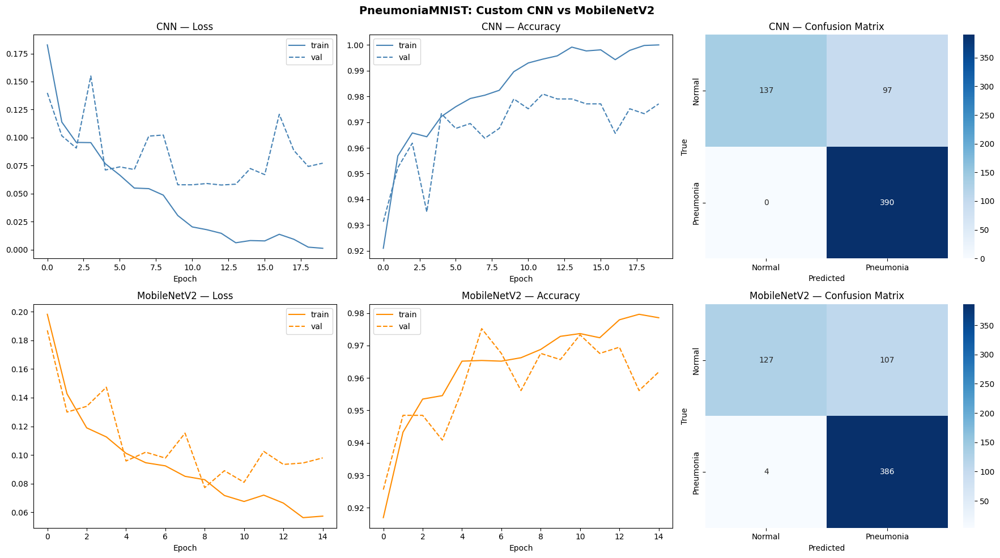

# Pneumonia Detection: Custom CNN vs MobileNetV2

Binary classification on chest X-rays using the [PneumoniaMNIST](https://medmnist.com/) dataset. Trains a custom CNN from scratch and fine-tunes a pre-trained MobileNetV2, then compares both on test accuracy, AUC, and confusion matrices.

## Dataset

PneumoniaMNIST is a subset of the MedMNIST benchmark derived from the X-ray dataset. It contains 5,856 pediatric chest X-ray images (28×28 grayscale) labelled as Normal or Pneumonia.

| Split | Samples |
|-------|---------|
| Train | 4,708   |
| Val   | 524     |
| Test  | 624     |

## Models

**Custom CNN** — three convolutional blocks (Conv → BatchNorm → ReLU → Pool) followed by a fully connected head. Trained on 28×28 grayscale inputs.

**MobileNetV2** — ImageNet pre-trained weights, last three feature blocks unfrozen, classifier replaced with a single binary output. Input resized to 224×224 and converted to 3-channel.

## Results

All metrics reported at Youden-J optimal decision threshold.

| Model       | Test Accuracy | Test AUC | Optimal Threshold |
|-------------|---------------|----------|-------------------|
| Custom CNN  | 0.91          | 0.967    | 0.999             |
| MobileNetV2 | 0.91          | 0.958    | 0.968             |

Both models defaulted toward predicting Pneumonia at threshold 0.5 due to 
class imbalance (390 pneumonia vs 234 normal in test set), reducing Normal 
recall to ~0.59. Youden-J threshold optimization corrected this without retraining.

## Threshold Optimization

Standard binary classifiers default to a decision threshold of 0.5. On imbalanced 
datasets this is rarely optimal — PneumoniaMNIST has a 5:3 pneumonia-to-normal ratio, 
which biases the model toward predicting the majority class. At threshold 0.5, the CNN 
correctly identified 100% of pneumonia cases but misclassified 41% of healthy patients 
as pneumonia (Normal recall: 0.59). In a clinical screening context, this false positive 
rate is unacceptable.

The decision threshold was optimized post-training using the Youden-J statistic:

$$J = \text{TPR} - \text{FPR} = \text{sensitivity} + \text{specificity} - 1$$

This finds the threshold that maximizes the geometric distance from the random-chance 
diagonal on the ROC curve — balancing sensitivity (catching true pneumonia cases) against 
specificity (correctly clearing healthy patients). Critically, this requires no retraining 
— it only shifts the cutoff applied to the model's existing probability outputs.

At the optimal threshold (0.999), Normal recall improved from 0.59 → 0.89 and overall 
accuracy from 0.845 → 0.910, with balanced precision across both classes. The unusually 
high threshold value indicates the model's raw probability outputs are poorly calibrated 
— predictions cluster near 0 and 1 rather than reflecting true class probabilities. This 
is a known consequence of training with BCE loss on small datasets without explicit 
calibration (e.g. temperature scaling). The AUC metric is unaffected by this, as it 
evaluates ranking ability across all thresholds rather than at any single cutoff.

## Training Curves & Confusion Matrices



CNN train loss converges cleanly to near-zero while val loss stabilizes around 0.075,
indicating good generalization without significant overfitting. The confusion matrix 
confirms the class imbalance issue at threshold 0.5 — 0 missed pneumonia cases but 
97 false positives on normal patients, corrected via threshold optimization.

MobileNetV2 val loss plateaus earlier (~epoch 6) and remains noisier throughout,
consistent with the domain shift hypothesis — the pre-trained features are partially 
misaligned with 28px chest X-ray inputs, limiting how cleanly the model converges.

## Benchmarking: 

| Method                     | AUC   | ACC   |
|:---------------------------|:-----:|:-----:|
| **Custom CNN (Optimized)** | **0.967** | **0.910** |
| Google AutoML Vision       | 0.991 | 0.946 |
| ResNet-50 (224)            | 0.962 | 0.884 |
| ResNet-18 (224)            | 0.956 | 0.864 |
| AutoKeras                  | 0.947 | 0.878 |
| ResNet-50 (28)             | 0.948 | 0.854 |
| ResNet-18 (28)             | 0.944 | 0.854 |
| auto-sklearn               | 0.942 | 0.855 |

## Usage

Open `pneumonia_mnist.ipynb` in Google Colab with a T4 GPU runtime. All dependencies are installed in the first cell.

```bash
# Local setup
pip install medmnist torch torchvision scikit-learn seaborn matplotlib
jupyter notebook pneumonia_mnist.ipynb
```


## References

- Yang et al., *MedMNIST Classification Decathlon: A Lightweight AutoML Benchmark for Medical Image Analysis*, IEEE ISBI 2021.
- Sandler et al., *MobileNetV2: Inverted Residuals and Linear Bottlenecks*, CVPR 2018.
- Kermany et al., *Identifying Medical Diagnoses and Treatable Diseases by Image-Based Deep Learning*, Cell 2018.
